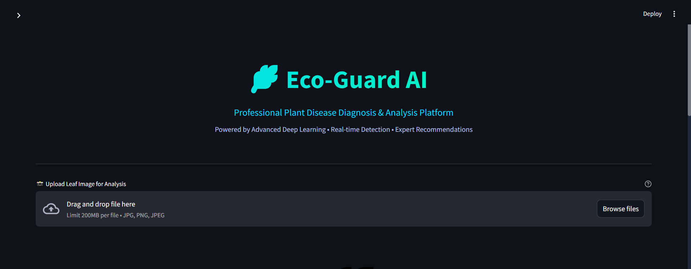

<h1 align="center">🌿 Plant Disease AI – Eco‑Guard</h1>

<p align="center">
  
</p>

<p align="center">
  <b>Professional dark‑themed Streamlit app for plant disease diagnosis, visual analytics, and treatment guidance.</b>
</p>

<p align="center">
  
  
  
  
</p>

---

## 🌌 Overview

**Eco‑Guard AI** is a professional Streamlit application that analyzes plant leaf images to detect diseases and estimate infection severity using a deep‑learning model. It supports three classes:

- ✅ Healthy  
- 🌫 Powdery Mildew  
- 🍂 Rust  

The app provides interactive dashboards, infection heatmaps, health indicators, treatment plans, and export options for reports and scan history.  


---

## ✨ Key Features

- 🔍 **AI‑Powered Diagnosis**  
  Uses a pre‑trained TensorFlow/Keras model (`plant_disease_model.h5`) to classify leaf images into Healthy, Powdery Mildew, or Rust with confidence scores.  

- 🌡 **Severity & Health Indicators**  
  Estimates infection severity and shows visual indicators such as Green Vitality, Stress Indicators, and Damaged Tissue metrics.  

- 🔥 **Infection Heatmap**  
  Generates color‑based heatmaps over the leaf to highlight affected regions for the predicted disease class.  

- 📊 **Analytics Dashboard**  
  Displays probability distributions across disease classes and action‑urgency metrics.  

- 💊 **Dynamic Treatment Plans**  
  Provides disease‑specific recommendations (organic, cultural, and chemical practices) when a disease is detected.  

- 🕒 **Session History & Trends**  
  Keeps a per‑session scanning history, totals, and distribution charts of previous diagnoses.  

- 📤 **Export & Sharing**  
  - Export text reports and CSV summaries  
  - Download processed images/heatmaps  
  - Share results via WhatsApp / Email links  

- 🎨 **Custom Dark UI Theme**  
  A dedicated `style.css` defines a premium dark palette, neon‑like accents, glassmorphism cards, and animated buttons for a polished professional look.

---

## 🧭 App Workflow

1. **Upload a Leaf Image**  
   - Supported formats: `JPG`, `JPEG`, `PNG`  
   - The image is preprocessed and fed into the deep‑learning model.  

2. **View Diagnosis** (Default tab)  
   - See predicted class, confidence percentage, infection severity, and the infection heatmap overlaid on the leaf image.  

3. **Explore Analytics**  
   - Inspect probability distribution across all classes and other diagnostic metrics.  

4. **Check Treatment Plan**  
   - Review tailored recommendations based on the predicted disease.  

5. **Review History & Trends**  
   - See the scans done in this session with basic stats and charts.  

6. **Export & Share**  
   - Download reports/CSVs or share via generated links.  

---

## 🧩 Tabs & Screens

| Tab                         | Description                                                                                  |
|-----------------------------|----------------------------------------------------------------------------------------------|
| 🔍 **Diagnosis**            | Upload, preview image, AI prediction, confidence gauge, severity, infection heatmap.        |
| 📊 **Analytics Dashboard**  | Class probability chart, action urgency / risk insights.                                     |
| 💊 **Treatment Plan**       | Disease‑specific treatment suggestions and best practices.                                   |
| 📜 **History & Trends**     | Per‑session scan history, distribution of classes, and basic analytics.                     |
| 📤 **Export & Share**       | Download text reports, CSVs, and images; generate shareable links.                          |


---

## 🏗️ Project Structure

```bash
.
├── app.py             # Main Streamlit application (Eco‑Guard AI)
├── style.css          # Custom dark theme & UI styling
├── cv-project.ipynb   # Computer vision / model notebook (experiments, prototyping, etc.)
└── plant_disease_model.h5  # Trained Keras model (required at runtime, not tracked by default)

```

## ▶ Running the App

Ensure the trained model file `plant_disease_model.h5` is available in the project root directory, then start the Streamlit server using the following command:

```bash
streamlit run app.py
```

Follow these steps to get the most out of **Eco-Guard**:

### 1. Upload an Image 📸
* Navigate to the **Diagnosis** tab (default).
* Upload a leaf image (`.jpg`, `.jpeg`, `.png`).
* The system automatically preprocesses the image and triggers the **CNN model** for real-time inference.

### 2. Review Diagnosis 🔍
Get immediate insights through:
* **Predicted Class:** (Healthy, Powdery Mildew, or Rust).
* **Confidence Score:** Percentage of model certainty.
* **Severity Level:** Estimated impact on the plant.
* **Heatmap Overlay:** Visual color-coded areas showing the infection zones.

### 3. Inspect Analytics 📊
Switch to the **Analytics Dashboard** to:
* Visualize the **Class Probability Distribution**.
* Explore advanced metrics to gauge environmental risk and urgency.

### 4. View Treatment Plan 💊
Receive actionable advice in the **Treatment Plan** tab:
* 🌿 **Cultural Practices:** Preventive manual care.
* 🦠 **Biological Control:** Eco-friendly & organic solutions.
* 🧪 **Chemical Suggestions:** Specific treatments (when necessary).

### 5. Track History & Trends ⏳
Stay organized with the **History & Trends** section:
* Review all scans from your current session.
* Monitor distribution charts and simple trend analysis.

### 6. Export & Share 📤
* **Reports:** Download a detailed text report of your scan.
* **Data:** Export session history as a `.csv` file.
* **Visuals:** Save generated heatmap images.
* **Social:** Generate instant sharing links for **WhatsApp** or **Email**.

---

## 🧠 Model & Architecture

The core of **Eco-Guard** relies on deep learning to ensure high accuracy in agricultural diagnostics.

| Feature | Specification |
| :--- | :--- |
| **Model File** | `plant_disease_model.h5` |
| **Architecture** | Convolutional Neural Network (CNN) |
| **Task** | Multiclass Classification |
| **Classes** | Healthy, Powdery Mildew, Rust |
| **Input Size** | RGB Images (Resized via `app.py`) |

> **Note:** The model file is not included in the repository by default due to size constraints. Please refer to the setup guide to download it.

---

## 🛠 Tech Stack
* **Backend:** Python / Flask (or Streamlit)
* **AI/ML:** TensorFlow / Keras
* **Data Visualization:** Plotly / Matplotlib
* **Image Processing:** OpenCV / PIL
